# Architecture

## 1. 构建环境

### Gradle

- Gradle Wrapper：`8.9`（`all` 分发包），配置见 `gradle/wrapper/gradle-wrapper.properties`。
- Android Gradle Plugin：`8.6.0`。
- Gradle 配置语言：Kotlin DSL。
- 根构建文件：`build.gradle.kts`。
- settings 文件：`settings.gradle.kts`。

### Android

- compileSdk：34。
- minSdk：24。
- targetSdk：34（`:app`）。
- Java source/target compatibility：1.8。
- Kotlin JVM target：1.8。

### Kotlin

- Kotlin Gradle Plugin：`1.9.24`。
- Compose Compiler：`1.5.14`（与 Kotlin `1.9.24` 对应）。
- KAPT：仅 feature 模块用于 ARouter 编译器。

### 构建变体

- flavor 维度：未配置。
- buildType：默认 `debug`、`release`；`release` 当前不启用代码压缩。DoKit 及三个设备调试面板仅通过 `debugImplementation` 打包，release 使用空初始化实现。
- 默认验证 variant：`debug`。

### APK 打包脚本

- 使用 `scripts/build-apk.sh` 统一生成 APK；必填参数为应用名称 `--name`、版本名称 `--version`、递增版本号 `--version-code` 和构建类型 `--type debug|release`。
- 脚本通过 Gradle 属性覆盖 `appName`、`versionName` 和 `versionCode`；直接执行常规 Gradle 任务时仍使用 app 模块中的默认值。
- 默认产物目录为 `artifacts/apk`，APK 文件名依次包含应用名称、版本名称、versionCode、Git 短提交号、工作区状态、连续数字构建时间和 debug/release 类型，同时生成同名 `.txt` 文件记录完整提交信息、构建时间、文件大小和 SHA-256。
- `release` 当前未配置正式签名；脚本会保留并明确标记 unsigned APK，正式分发前需接入 release signingConfig。

## 2. 模块依赖关系

### 模块依赖图

```mermaid
graph TD
    app[":app"] --> common[":core:common"]
    collection --> waveformUi[":foundation:device-waveform-ui"]
    app --> navi[":core:navi"]
    app --> permission[":core:permission"]
    app --> bluetooth[":foundation:bluetooth"]
    deviceTransport[":foundation:device-transport"] --> bluetooth
    deviceSdk[":foundation:device-sdk"] --> deviceApi[":foundation:device-api"]
    deviceSdk --> deviceTransport
    deviceSdk --> deviceProtocol[":foundation:device-protocol"]
    deviceSdk --> deviceCommand[":foundation:device-command"]
    deviceSdk --> deviceStorage[":foundation:device-storage"]
    deviceSdk --> deviceWaveform[":foundation:device-waveform"]
    deviceCommand --> deviceTransport
    userFeature --> storage[":core:storage"]
    app --> home[":feature:home"]
    app --> userFeature[":feature:user"]
    app --> questionnaire[":feature:questionnaire"]
    app --> collection[":feature:collection"]
    app --> analysis[":feature:analysis"]
    app -. debug only .-> dokitBluetooth[":debug:dokit-bluetooth"]
    app -. debug only .-> dokitProtocol[":debug:dokit-protocol"]
    app -. debug only .-> dokitWaveform[":debug:dokit-waveform"]
    dokitBluetooth --> deviceApi
    dokitProtocol --> deviceApi
    dokitWaveform --> waveformUi
    home --> common
    home --> navi
    home --> userProvider
    home --> collectionProvider
    collection --> deviceProvider
    questionnaire --> common
    questionnaire --> navi
    collection --> common
    collection --> navi
    collection --> bluetooth
    collection --> deviceApi
    collection --> deviceSdk
    collection --> collectionProvider
    questionnaire --> collectionProvider
    analysis --> common
    analysis --> navi
    userFeature --> common
    userFeature --> navi
    userFeature --> userProvider
```

### 模块依赖表

| 模块 | 类型 | 直接依赖 | 被谁依赖 | 变更影响 |
|---|---|---|---|---|
| `:app` | Android application | common、navi、permission、foundation:bluetooth、provider:record、provider:user、5 个 feature | 无 | 应用启动、全局蓝牙初始化、首页壳层、采集记录及其用户关联查询和发布产物 |
| `:core:common` | Android library | AndroidX、Compose | app、全部 feature | 公共 UI 与通用模型的全局影响 |
| `:core:navi` | Android library | common、AppCompat、Fragment、ARouter API | app、provider、全部 feature | Activity/Fragment 路由契约、返回策略与导航宿主的全局影响 |
| `:core:permission` | Android library | AndroidX Core、Fragment | app（配置注入） | 可注入权限定义、检查、申请、端内兜底弹窗和设置页跳转的全局影响 |
| `:core:storage` | Android library | AndroidX Core、MMKV | collection | 通用本地键值存储与加密策略 |
| `:foundation:bluetooth` | Android library | AndroidX AppCompat | app、feature:collection | 经典蓝牙与 BLE 扫描、连接、读写及事件回调基础能力；由 app 在 Application 中完成全局配置 |
| `:foundation:device-waveform-ui` | Android library | Compose | feature:collection（及后续回放/分析页面） | 物理图纸标定、实时波形缓冲和绘制策略 |
| `:foundation:device-api` | Android library | Coroutines | device-*、collection | 设备会话、聚合帧、命令与消费流稳定契约 |
| `:foundation:device-transport` | Android library | device-api、bluetooth | device-command、device-sdk | 把蓝牙回调适配为字节流及挂起式连接/写入 |
| `:foundation:device-protocol` | Android library | device-api | device-sdk | 环形缓冲、拦截器拆包、校验、连续性及聚合帧解析 |
| `:foundation:device-command` | Android library | device-api、device-transport | device-sdk | 有界优先级队列、单飞指令、回执、超时与幂等重试 |
| `:foundation:device-storage` | Android library | device-api | device-sdk | 解析后聚合帧异步文件记录 |
| `:foundation:device-waveform` | Android library | device-api | device-sdk | ECG/呼吸波形投影和慢消费者隔离 |
| `:foundation:device-sdk` | Android library | bluetooth、全部 device 子模块 | collection | 设备能力总壳、会话生命周期和自动分发 |
| `:provider:user` | Android library | ARouter API | app、home、collection、analysis、feature:user | 用户资料、指纹及历史关联查询契约的影响面 |
| `:provider:collection` | Android library | navi、ARouter API | home、questionnaire、collection | 采集流程状态机契约的影响面 |
| `:provider:device` | Android library | ARouter API、bluetooth | collection、analysis | 最近成功连接设备的 `DeviceInfo`、内部写卡记录及兼容设备对象契约 |
| `:provider:record` | Android library | ARouter API、Coroutines | app、collection | 已完成采集记录的查询、观察与保存契约 |
| `:feature:home` | Android library | common、navi、provider:user、provider:collection | app | 采集入口与任务列表 |
| `:feature:user` | Android library | common、navi、provider:user、Room | app | 用户资料 Activity、内部 Fragment 与 Room 用户资料实现 |
| `:feature:questionnaire` | Android library | common、navi、provider:collection | app | 前后问卷 Activity 与内部 Fragment |
| `:feature:collection` | Android library | common、device-waveform-ui、navi、storage、foundation:bluetooth、device-api、device-sdk、provider:collection、provider:device、provider:record、Room | app | BLE 设备、采集 Activity、内部 Fragment、完成记录与流程状态机实现 |
| `:feature:analysis` | Android library | common、navi | app | 分析 Activity 与内部 Fragment |
| `:debug:dokit-bluetooth` | Android library（debug only） | device-api、DoKit | app debug | 蓝牙连接、完整原始 RX/TX 数据调试面板 |
| `:debug:dokit-protocol` | Android library（debug only） | device-api、DoKit | app debug | 协议缓冲、拆包恢复、指令及回执调试面板 |
| `:debug:dokit-waveform` | Android library（debug only） | device-waveform-ui、DoKit | app debug | ECG/呼吸环形缓冲容量、游标、覆盖和采样范围调试面板 |

## 3. 工程分层

- `:app` 是组合层，持有 `VitalHubApplication`、首页 `MainActivity`、系统栏/标题栏、底部导航和首页 Fragment 返回栈。
- `:core:common` 是跨模块基础层，暴露通用模型与共享 Compose 能力；不应依赖业务 feature。
- `:foundation:device-waveform-ui` 是独立绘制基础层，只接收 `IntArray` 采样和 UI 连线语义；不依赖蓝牙、设备协议或业务 feature。
- `:core:navi` 是跨模块导航基础层，暴露 `Routes`、`Navigator`、`BaseFlowActivity`、导航宿主接口、页面元数据与导航去重；不依赖业务 feature。
- `:core:permission` 是跨模块基础层，封装可注入的运行时权限契约、检查、申请、端内拒绝兜底弹窗及设置页跳转；应用层配置权限定义、路由守卫和宿主依赖，功能模块仅在各自 Manifest 声明所需权限。
- `:core:storage` 是跨模块基础层，封装本地键值存储；业务模块只依赖其公开的 `KVStorage`/`Storage` API，不直接依赖具体存储后端。
- `:foundation:bluetooth` 是蓝牙基础能力层，封装经典蓝牙与 BLE 的扫描、连接、读写和回调，不依赖业务 feature。
- `:foundation:device-*` 按 API、传输、协议、指令、存储、波形和总壳拆分；协议层持有环形缓冲和通用拦截器外层，总壳把解析后的同一聚合帧自动分发给不同消费者。
- `:app` 在 `VitalHubApplication` 中统一初始化 `BluetoothKit` 及扫描规则；业务 feature 只获取并使用已初始化的单例。
- `:provider:user` 是继承 `IProvider` 的用户资料能力契约层；`:feature:user` 负责资料编辑、Room 用户表、指纹与 active/inactive 状态切换及 `/user/service` ARouter 服务注册。
- `:provider:collection` 是继承 `IProvider` 的采集流程状态机契约层；`:feature:collection` 负责 MMKV 实现及 `/collection/flow/service` 服务注册。
- `:provider:device` 是继承 `IProvider` 的最近连接设备契约层；Parcelable `DeviceInfo` 保存设备名称、MAC 和可选的设备内部写卡 `DeviceRecordInfo`，并通过 `getRecordInfo()` 单独暴露写卡记录。`:feature:collection` 将其作为单个对象持久化，负责 MMKV 实现及 `/device/service` 服务注册；写入统一使用 `saveDevice(DeviceInfo)`，旧层仅保留设备对象、名称和 MAC 查询接口。
- `:provider:record` 是继承 `IProvider` 的完成记录契约层；`:feature:collection` 负责 Room 实现及 `/record/service` 服务注册，`:app` 只通过契约查询。
- feature 模块不直接依赖彼此，使用 ARouter 路径经 `Navigator` 跳转。
- 三个 `:debug:dokit-*` 模块只消费 foundation 暴露的惰性调试快照，不被业务模块依赖；工具以宿主 Activity 内可拖动的数据卡片展示并保留完整详情页，不申请系统悬浮窗权限。DoKit SDK 只存在于 app debug 运行时，release 不打包悬浮卡片或面板 Activity。

## 4. 跨模块影响面判断

- 修改 `Routes`、`RouteArgs`、`Navigator` 或 `FlowNavigationHost`：检查 app 与所有相关 feature 的路由注册、参数和返回栈。
- 修改 `MainActivity`、`AppShellViewModel`、底栏或标题栏：检查顶级目的地和所有 `AppBarDestination` / `BottomNavigationDestination` 的实现。
- 修改 BLE 权限或 `feature:collection` Manifest：同时确认 Android 版本兼容性和应用合并 Manifest。
- 增加共享模型、导航策略或公共 UI：分别优先评估是否属于 `:provider:*`、`:core:navi`、`:core:common`；未被多模块消费的实现留在 feature 内。

## 5. 工程框架文档索引

| 主题 | 场景 | 文档 |
|---|---|---|
| 应用壳与路由 | ARouter、Activity/Fragment 宿主、Compose 顶栏与底栏 | `docs/architecture/app-shell.md` |
| 业务架构概览 | 业务模块职责、核心标识、推荐数据层 | `ARCHITECTURE.md` |
| 记录仪设备 SDK | BLE 字节流、协议、指令队列、聚合帧、画图与文件消费 | `docs/architecture/device-sdk.md` |
