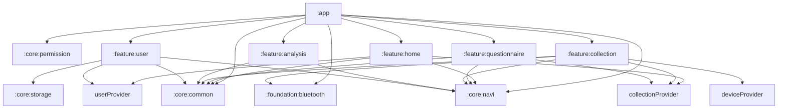

# Architecture

## 1. 构建环境

### Gradle

- Gradle Wrapper：`8.9`（`all` 分发包），配置见 `gradle/wrapper/gradle-wrapper.properties`。
- Android Gradle Plugin：`8.6.0`。
- Gradle 配置语言：Kotlin DSL。
- 根构建文件：`build.gradle.kts`。
- settings 文件：`settings.gradle.kts`。

### Android

- compileSdk：34。
- minSdk：24。
- targetSdk：34（`:app`）。
- Java source/target compatibility：1.8。
- Kotlin JVM target：1.8。

### Kotlin

- Kotlin Gradle Plugin：`1.9.24`。
- Compose Compiler：`1.5.14`（与 Kotlin `1.9.24` 对应）。
- KAPT：仅 feature 模块用于 ARouter 编译器。

### 构建变体

- flavor 维度：未配置。
- buildType：默认 `debug`、`release`；`release` 当前不启用代码压缩。
- 默认验证 variant：`debug`。

## 2. 模块依赖关系

### 模块依赖图

### 模块依赖表

| 模块 | 类型 | 直接依赖 | 被谁依赖 | 变更影响 |
|---|---|---|---|---|
| `:app` | Android application | common、navi、permission、foundation:bluetooth、5 个 feature | 无 | 应用启动、全局蓝牙初始化、首页壳层和发布产物 |
| `:core:common` | Android library | AndroidX、Compose | app、全部 feature | 公共 UI 与通用模型的全局影响 |
| `:core:navi` | Android library | common、AppCompat、Fragment、ARouter API | app、provider、全部 feature | Activity/Fragment 路由契约、返回策略与导航宿主的全局影响 |
| `:core:permission` | Android library | AndroidX Core、Fragment | app（配置注入） | 可注入权限定义、检查、申请、端内兜底弹窗和设置页跳转的全局影响 |
| `:core:storage` | Android library | AndroidX Core、MMKV | feature:user（及后续需要本地 KV 的模块） | 通用本地键值存储与加密策略 |
| `:foundation:bluetooth` | Android library | AndroidX AppCompat | app、feature:collection | 经典蓝牙与 BLE 扫描、连接、读写及事件回调基础能力；由 app 在 Application 中完成全局配置 |
| `:provider:user` | Android library | ARouter API | home、feature:user | 用户资料数据契约的影响面 |
| `:provider:collection` | Android library | navi、ARouter API | home、questionnaire、collection | 采集流程状态机契约的影响面 |
| `:provider:device` | Android library | ARouter API | collection | 最近成功连接设备的持久化查询与保存契约 |
| `:feature:home` | Android library | common、navi、provider:user、provider:collection | app | 采集入口与任务列表 |
| `:feature:user` | Android library | common、navi、storage、provider:user | app | 用户资料 Activity、内部 Fragment 与本地资料实现 |
| `:feature:questionnaire` | Android library | common、navi、provider:collection | app | 前后问卷 Activity 与内部 Fragment |
| `:feature:collection` | Android library | common、navi、storage、foundation:bluetooth、provider:collection | app | BLE 设备、采集 Activity、内部 Fragment、记录与流程状态机实现 |
| `:feature:analysis` | Android library | common、navi | app | 分析 Activity 与内部 Fragment |

## 3. 工程分层

- `:app` 是组合层，持有 `VitalHubApplication`、首页 `MainActivity`、系统栏/标题栏、底部导航和首页 Fragment 返回栈。
- `:core:common` 是跨模块基础层，暴露通用模型与共享 Compose 能力；不应依赖业务 feature。
- `:core:navi` 是跨模块导航基础层，暴露 `Routes`、`Navigator`、`BaseFlowActivity`、导航宿主接口、页面元数据与导航去重；不依赖业务 feature。
- `:core:permission` 是跨模块基础层，封装可注入的运行时权限契约、检查、申请、端内拒绝兜底弹窗及设置页跳转；应用层配置权限定义、路由守卫和宿主依赖，功能模块仅在各自 Manifest 声明所需权限。
- `:core:storage` 是跨模块基础层，封装本地键值存储；业务模块只依赖其公开的 `KVStorage`/`Storage` API，不直接依赖具体存储后端。
- `:foundation:bluetooth` 是蓝牙基础能力层，封装经典蓝牙与 BLE 的扫描、连接、读写和回调，不依赖业务 feature。
- `:app` 在 `VitalHubApplication` 中统一初始化 `BluetoothKit` 及扫描规则；业务 feature 只获取并使用已初始化的单例。
- `:provider:user` 是继承 `IProvider` 的用户资料能力契约层；`:feature:user` 负责资料编辑、MMKV 本地实现及 `/user/service` ARouter 服务注册。
- `:provider:collection` 是继承 `IProvider` 的采集流程状态机契约层；`:feature:collection` 负责 MMKV 实现及 `/collection/flow/service` 服务注册。
- `:provider:device` 是继承 `IProvider` 的最近连接设备契约层；`:feature:collection` 负责兼容既有存储的 MMKV 实现及 `/device/service` 服务注册。
- feature 模块不直接依赖彼此，使用 ARouter 路径经 `Navigator` 跳转。

## 4. 跨模块影响面判断

- 修改 `Routes`、`RouteArgs`、`Navigator` 或 `FlowNavigationHost`：检查 app 与所有相关 feature 的路由注册、参数和返回栈。
- 修改 `MainActivity`、`AppShellViewModel`、底栏或标题栏：检查顶级目的地和所有 `AppBarDestination` / `BottomNavigationDestination` 的实现。
- 修改 BLE 权限或 `feature:collection` Manifest：同时确认 Android 版本兼容性和应用合并 Manifest。
- 增加共享模型、导航策略或公共 UI：分别优先评估是否属于 `:provider:*`、`:core:navi`、`:core:common`；未被多模块消费的实现留在 feature 内。

## 5. 工程框架文档索引

| 主题 | 场景 | 文档 |
|---|---|---|
| 应用壳与路由 | ARouter、Activity/Fragment 宿主、Compose 顶栏与底栏 | `docs/architecture/app-shell.md` |
| 业务架构概览 | 业务模块职责、核心标识、推荐数据层 | `ARCHITECTURE.md` |
